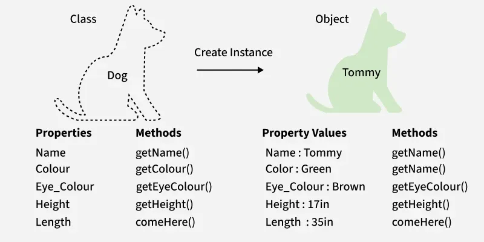
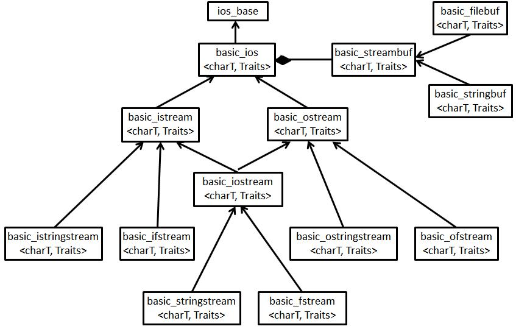

# 🏗️ WIP
**Which means**:
- **Incomplete** information
- **Typos** and bad english
- Some **internal links** may not redirect you as wanted
- Some **sources** can be missing

***

# Philosophy
[Bjarne Stroustrup](https://www.stroustrup.com/), the creator of C++, designed the language with a philosophy centered on providing **flexibility** without sacrificing **efficiency or performance**.

- **General-purpose**: C++ should be usable for low-level system programming, as well as for high-level abstractions.
- **Multi-paradigm**: Support for procedural, object-oriented, and generic programming paradigms.
- **Control over Resources**: Features like constructors, destructors, and RAII (Resource Acquisition Is Initialization) provide systematic and safe resource management.
- **Extensibility and Compatibility**: Designed to extend C without breaking compatibility, allowing programs to grow from C to C++ smoothly.
- **Type Safety with Flexibility**: Strong static typing that supports user-defined types while allowing low-level access when needed.

## Some applications

- **Adobe Systems**: Most applications are developed in C++:
    - Photoshop & ImageReady,
    - Illustrator,
    - Acrobat,
    - InDesign,
    - GoLive,
    - Frame (mostly C, some C++)

- **Apple** Finder

- **Dassault Systems**: Catia v5 (CAD) on which was notably conceived all recent Airbus planes.

- **Microsoft**: Literally everything at Microsoft is built using recent flavors of Visual C++ (using older versions would automatically cause an application to fail the security review). The list would include major products like:
    - Windows XP, Vista, System 7
    - Windows NT (NT4 and 2000)
    - Windows 9x (95, 98, Me)
    - Microsoft Office (Word, Excel, Access, PowerPoint, Outlook)
    - Internet Explorer (including Outlook Express)
     - Visual Studio (Visual C++, Visual Basic, Visual FoxPro) (Some parts of Visual Studio like the Base Class Libraries that ship with the .NET Framework were written using C# but the C# compiler itself is written in C++.)
     - Exchange
    - SQL

- **KDE** (K Desktop Environment): powerful open source graphical desktop environment for Unix workstations. It consists of about 300 different packages written in C++, including an office suite, a browser, development tools, games, and multimedia apps.

> ℹ️ See [Applications](https://www.stroustrup.com/applications.html) (stroustrup.com)

***

# Hello World !

Your C++ journey begins with a *simple* but **powerful** program.

```cpp
#include <iostream>

int main(void)
{
    std::cout << "Hello World !" << std::endl;

    return (0);
}
```

Let's break this program down to introduce some core-concepts:

```cpp
#include <iostream>
```

- `#` indicates a **preprocessor** statement. Before your code is compiled, the preprocessor *processes* all these statements.

- Similarly to C, you need to `include` **libraries** to be able to use them.

- `iostream` is the **standard input/output** [stream](#stream) library. Which here, allows you to use `std::cout` and `std::endl`

> ℹ️ See:
>- [Preprocessor](https://en.cppreference.com/w/cpp/preprocessor.html) (cppreference.com)
>- [*How to use librairies in C++*](https://stackoverflow.com/questions/10358745/how-to-use-libraries) (stackoverflow.com)
>- [`iostream`](https://en.cppreference.com/w/cpp/header/iostream.html) (cppreference.com)


```cpp
std::cout << "Hello World !" << std::endl;
```

- `std` stands for **standard [namespace](#namespace)**, which groups together **names** ([classes](#classes), functions, [objects](#objects) ...) defined by the C++ standard library.

- `::` is the **scope resolution operator**. It is used to **access a name** that belongs to a specific [**scope**](#scope).

- `cout` stands for ***console out***, which is a global [**object**](#objects) representing the **standard output stream**.

- `<<` is the **stream insetion operator**. **In this case**, it is used to sends the value on its right into the [stream](#stream) on its left. Multiple `<<` can be chained to send several *concatenated* pieces of data.

- `endl` stands for ***end line***, which is a **manipulator** that inserts the newline character (`\n`) and then flushes the output buffer.

> ℹ️ See:
>- [C++ Standard Library](https://en.cppreference.com/w/cpp/standard_library.html) (cppreference.com) or [C++ Standard Library](https://en.wikipedia.org/wiki/C%2B%2B_Standard_Library) (wikipedia.org)
>- [Scope resolution operator](https://www.geeksforgeeks.org/cpp/scope-resolution-operator-in-c/) (geeksforgeeks.org)
>- [Manipulators in C++](https://www.geeksforgeeks.org/cpp/manipulators-in-c-with-examples/) (geeksforgeeks.org)

***

# Classes
## Concept
A `class` in C++ is a user-defined type that acts as a blueprint for creating [objects](#objects), grouping together related data ([attributes and functions (methods)](#members-attributes--methods)) into one single unit.

A `class` defines how objects of that type are **structured** and **behave**.

Classes allow you to model **complex entities** (like cars, accounts, or shapes) by encapsulating their attributes and behaviors in one place.

```cpp
// Rectangle.hpp
class Rectangle
{
    public:
        int width;
        int height;
};
```

> ℹ️ See [Classes](https://en.cppreference.com/w/cpp/language/classes.html) (cppreference.com)

## Construct and destruct an instance

To create an **instance** of a given `class`, you will have to define a **[public](#access-specifiers)** ***constructor*** and a ***destructor*** in order to respectively *construct* and *destruct* a class **instance** outside its own scope.

> ⚠️ Each constructor/destructor **has to be defined**.

### Constructor

A **constructor** is a special [member function](#members-attributes--methods) executed when an object is declared, initializing the object’s **state**, [members and base class](#inheritence) : calling their respective constructors.

- C++ allows a class to have **multiple constructors**, each with different parameter lists (**overloading**).

- A constructor without any parameter become the **default constructor**. It will be automatically called at the instance declaration.

- If **no constructors are declared**, the compiler automatically generates a default constructor which is qualified as ***trivial*** : it **only** performs member and base class ***default initializations***.
    > **Default initialization** depends on member's **datatype**:
    >- **Built-in types**: Remain **uninitialized**, contain indeterminate values (same logic as C).
    >- **Class-type** members: Each member's default constructor is called.

- If any constructor is declared, but **none is a default constructor**, the compiler **does not** generate one.


```cpp
className(/* optionnal parameters */);
```
> ℹ️ See:
>- [Default Constructor](https://en.cppreference.com/w/cpp/language/default_constructor.html) (cppreference.com)
>- [Default Initializations](https://en.cppreference.com/w/cpp/language/default_initialization.html) (cppreference.com)

### Destructor

The **destructor** is run when an object’s lifetime ends (when it goes out of scope or after a `delete` call), releasing resources.

- **Only one destructor** is permitted per class.

- Overloading destructors is not allowed (can never take arguments or return a value).

- Can be virtual (should be for [polymorphic](#polymorphism) base classes)

> ℹ️ See [`virtual` functions](https://www.geeksforgeeks.org/cpp/virtual-function-cpp/) (geeksforgeeks.org)

```cpp
~className(); // No overloading
```

### Example

```cpp
// Rectangle.hpp
class Rectangle
{
    public:
        Rectangle();                        // default
        Rectangle(int width, int height);   // overloaded
        ~Rectangle();                       // default
   // ...
};
```


> ℹ️ See
>- [Members Attribtes & Methods](#members-attributes--methods)
>- [Access Specifiers](#access-specifiers)
>- [Orthodox Canonical class form](#members-attributes--methods)

## Classes vs Structs

Both classes and structs are user-defined types that can contain attributes and functions.
Meanwhile, classes allows you to set up **access specifiers** (private by default) to build **complex** data-types, in an [OOP](https://en.wikipedia.org/wiki/Object-oriented_programming)-way with desidered **accessibility and behavioral restrictions**.

### POD
Sometimes you will not need a `class`. Programming in C++ does not mean putting some classes everywhere.
***POD*** stands for **Plain Old Data**, it describes types that have **simple**, **C-compatible** memory layout and behavior.

A type is *POD* if it satisfies two requirements:
- [Trivial](#constructor) (simple construction/destruction)
- Standard layout (C-compatible memory layout)

To check if the `class` you created is POD (and then should -*in most cases*- be a struct), you can use the [UnaryTypeTrait](https://en.cppreference.com/w/cpp/named_req/UnaryTypeTrait.html) ([class template](https://www.en.cppreference.com/w/cpp/language/class_template.html)) `std::is_pod<T>` (⚠️ C++11) as follows:

```cpp
std::cout << std::is_pod<Class>::value << std::endl;
```

> ℹ️ See
>- [Passive data structure](https://en.wikipedia.org/wiki/Passive_data_structure) (wikipedia.org) and [Plain Old Object (C++)](https://en.wikipedia.org/wiki/Plain_Old_C%2B%2B_Object) (wikipedia.org)
>- [std::is_pod](https://cplusplus.com/reference/type_traits/is_pod/) (cplusplus.com) or [std::is_pod](https://en.cppreference.com/w/cpp/types/is_pod.html) (cppreference.com)
>- [Template](https://www.en.cppreference.com/w/cpp/language/templates.html) (cppreference.com) or [Templates in C++](https://www.geeksforgeeks.org/cpp/templates-cpp/) (geeksforgeeks.org)

#### Choose the adequate datatype

|   Use Case                            |  Prefer `struct` |   Prefer `class`  |
|   ----------------------------------- | ---------------  |   --------------- |
|   Passive data grouping               |  Yes             |   No              |
|   Complex invariants/behavior         |  No              |   Yes             |
|   Encapsulation required              |  No              |   Yes             |
|   C compatibility                     |  Yes             |   No              |
|   Methods controlling the data        |  No              |   Yes             |
|   Real life object abstraction        |  No              |   Yes             |

> ℹ️ See
>- [Invariant](https://www.geeksforgeeks.org/cpp/what-is-class-invariant) (geeksforgeeks.org)
>- [Classes and class hierarchies](https://isocpp.github.io/CppCoreGuidelines/CppCoreGuidelines#c-classes-and-class-hierarchies) (isocpp.github.io)

***

# Objects

An object is an entity.

> *C++ programs create, destroy, refer to, access and manipulate objects.*
>
> ℹ️ See [Object](https://en.cppreference.com/w/cpp/language/object.html) (cppreference.com)


## Objects can be sorted in differents categories...
- Fundamental type objects
```cpp
int x;
```

- Pointer objects :
```cpp
int *ptr;
```

- Array objects :
```cpp
int array[42];
```

- Class-type objects
```cpp
std::string str;
```

## ...and they have differents key characteristics.

- **Type**: Each determined at compile-time (C++ is a statically typed language).
```cpp
typeid(variable).name()
```

- **Storage**: Objects occupy memory with specific size.
```cpp
sizeof(variable)
```

- **Lifetime**: Objects have well-defined creation and destruction points.
    - **Memory allocation**: The compiler reserves memory for the object. For **stack** objects, memory is allocated when execution enters the block while for **heap** objects (via `new`), memory is allocated in the available memory space.
    - **Constructor execution**: Class-type objects invoke a [constructor](#construct-and-destruct-an-instance) that initializes **member** variables and *may acquire resources*.
        Constructors can be **default** (no parameters), **parameterized**, or **copy** constructors (cf. [Orthodox Canonical class form](#orthodox-canonial-form)).
        During this phase, ***base class*** (!= derived) constructors run first (for inheritance), then member objects' constructors, and finally the enclosing class's constructor itself.

    - **Lifetime begins**: Once construction is complete, the object becomes *usable*.

    - **Destructor execution**: When the object's lifetime ends (either automatic [scope](#scope) exit or `delete` for dynamic objects), its [destructor](#construct-and-destruct-an-instance) runs. The **destructor** is responsible for releasing resources.
        For class hierarchies, destructors run in reverse: the enclosing class destructor first, then member objects' destructors, and finally base class destructors.

    - **Memory deallocation**: Memory is released back to the system, either automatically for stack objects or manually for heap objects with delete.

    > ℹ️ See:
    >- [Memory allocation, pointers & references](#memory-allocation-pointers--references)
    >- [Classes](#classes)
    >- [Inheritence](#inheritence)

- **Identity**: Each object has a unique address in memory (except for [bit-fields](https://en.wikipedia.org/wiki/Bit_field) and [register variables](https://en.wikipedia.org/wiki/Register_(keyword))).

    An object is addressable if:

    - **Occupies Memory**: Has a location in the program's address space

    - **Byte-Aligned**: Can be referenced by a byte address (eg. bit-field)

    - **Observable**: Not completely optimized away by the compiler

- **State**: Objects maintain internal data that can change over time (eg. register variables).

    An object's state is the **complete set of values held by all its member variables** (data members), at anytime during runtime.
    The state represents the object's "*configuration*" that distinguishes one instance from another of the same type.

    > 💡 [Static members](#static--const-keywords) belong to the class as a whole, not an individual object's state.

    ```cpp
    // Rectangle.hpp
    class Rectangle
    {
        int width;
        int height;
    };
    ```

    ```cpp
    // main.cpp
    Rectangle rect;

    rect.width = 4;
    rect.height = 2;
    ```
    The **state** of `rect` (instance from the `Rectangle` class) is, at a given instant during runtime: `{width = 4; height = 2;}`.

- **Value**: An object's value generally refers to the *abstract* interpretation of the **object's state as a single meaningful entity** used in computations or comparisons.

    ```cpp
    rect.width = 4;
    ```

> 💡 **Distinction**
>
>```cpp
>// main.cpp
>Rectangle r1 = {4, 2};
>Rectangle r2 = {4, 3};
>```
>- **Identity**: `&r1 != &r2` (different memory locations)
>- **State**: `r1 = {width = 4, height = 2}` and `r2 = {width = 4, height = 3}` (different states)
>- **Value**: `r1.width == r2.width` (both have a height of 4)

***

# Members: attributes & methods

## Encapsulation

Encapsulation is the object-oriented principle of bundling **data** ([state](#objects)) and **behavior** ([methods](#methods)) into a class and **restricting direct access** to some of the object’s components. This enforces **modularity**, **maintainability**, and **robustness**.

- **Information hiding**: Prevent external code from depending on internal representations.
- **Maintain invariants**: Control how **state changes** so the object remains in a valid condition.
- **Improve compilation efficiency**: **Minimize dependencies** between modules.
- **Increase robustness**: Prevent **misuse** of an object’s **internal data**.

## Attributes

Attributes are variables (often called *data members*) that belong to the class and **define the properties** of the objects instanciated from this class.
A good practice is to have a maximum amount of `private` or `protected` data.

```cpp
int height;
```

## Methods

Methods are functions (often called *member functions*) that belong to a determined class. They are used to **manipulate the class's data** members.
We often use simple mono use function to *get* or *set* private attributes, we call them respectively **getters** and **setters**.

```cpp
int getHeight(void);
```

## Access specifiers

In C++, you can restrict the visibility and the accessibility to determined class members. C++ provides three access specifiers :

- **`public`** : accessible from **anywhere** in the code. May be useful notably for **public constants**, **constructors and destructors**.
- **`protected`** : accessible within [base and derived](#inheritence) classes. Useful to build *in-class sub-restrictions*.
- **`private`** : only accessible within the class. Core-concept of [encapsulation](#encapsulation).

> 💡 **Good practices tips**
>- A well-designed class keep private a maximum amount of data, while having some ***[getters/setters](#methods)*** to respectively read or modify them.
>- When building a `class`, start setting all members as `private`, then you will set as `public` only the needed members.

|   Keyword         |   *Within* the class  |   From *derived* classes  |   From *outside*  the class    |
|   --------------- | --------------------- | ------------------------- |   ---------------------------- |
|   **`public`**    |   yes                 |   yes                     |   yes                          |
|   **`protected`** |   yes                 |   yes                     |   no                           |
|   **`private`**   |   yes                 |   no                      |   no                           |

> 💡 By default, each member declared inside a `class` is **private**.

> ℹ️ See [Inheritence](#inheritence)

## Some other keywords

### `static`

Static data members are not associated with the objects of the class: they are **independent** variables/functions with **static storage duration**. They still belong to the `class`.

They are useful for maintaining a shared data among all instances of the class.

**Static attributes**
- **Only one copy** of that member is created for all instances of a given `class`.
- They have to be **defined once**, given the **ODR (One Definition Rule)** and the fact that **definition** occurs while instanciating a `class` into an object : you have to define them **outside the class**, and **outside any function**.
- Its lifetime is the **entire program** but its **visibility** is limited to the actual **translation unit**.
- They cannot be associated with `mutable` keyword.

```cpp
// staticAttribute.hpp
class Entity
{
    public:
        static int count;                       // declaration
        Entity(void) { ++this->count; };
};

```

```cpp
// main.cpp
int Entity::count;                              // definition

int	main(void)
{
    Entity e1;
    Entity e2;

    std::cout << Entity::count << std::endl;    // outputs 2

    return (0);
}
```

> ℹ️ See:
>- [Static Data Members](https://www.geeksforgeeks.org/cpp/cpp-static-data-members/) (geeksforgeeks.org)
>- [ODR (One Definition Rule)](https://en.cppreference.com/w/cpp/language/definition.html) (cppreference.com)
>- [*Why does a static data member need to be defined outside of the class ?*](https://stackoverflow.com/questions/18749071/why-does-a-static-data-member-need-to-be-defined-outside-of-the-class) (stackoverflow.com)

**Static methods**
- It's basically a normal function that's nested inside of the scope of the class.
- Can be called **without creating an object**.
- Only has access to **static members (attributes or methods)**.
- Cannot use `this` to refer to a member because they don't belong to any instance of the `class`.
    > 💡 `this` is a pointer to the actual instance.
- Useful when a function’s logic is **independent** of object state.
- They cannot be associated with `virtual`, `const` or `volatile`.

```cpp
// staticMethods.hpp
class Entity
{
    public:
    	static int getValue(void) { return (_value); }; // declaration

    private:
    	static int _value;
};

```

```cpp
// main.cpp
int Entity::_value = 42;                            // definition & initialization

int	main(void)
{                                                   // no need to instanciate an object
    std::cout << Entity::getValue() << std::endl;   // outputs 42

    return (0);
}
```

> ℹ️ See:
>- [Static Members Function](https://www.geeksforgeeks.org/cpp/static-member-function-in-cpp/) (geeksforgeeks.org)
>- [Storage class specifiers](https://en.cppreference.com/w/cpp/language/storage_duration.html) (cppreference.com)


### `const`

**Constant objects**
- Object's **state** cannot be modified.
- Cannot **call non-`const` member functions**.
- `const` has to be writen at the end of the prototype, else this is the return datatype that will qualified as `const`.

**Constant methods**
- Can be called on **any type of object**.
- Can **only modify** `static` or `mutable` attributes.

> 💡 **Good to know**
>
> The const property of an object goes into effect **after the constructor** finishes executing and ends **before the class's destructor** executes. So the constructor and destructor can modify the data members of the object, but other methods of the class can't.


```cpp
// constObjects.hpp
class Entity
{
    public:
        Entity(int id, std::string name)        // overloaded constructor
        {
            this->_id = id;
            this->_name = name;
        }
        void        displayEntity(void) const   // const qualifier at the end of the prototype
        {
            std::cout << this->_id << ": " << this->_name << std::endl;
        };

    private:
        int         _id;
        std::string _name;
};

```

```cpp
// main.cpp
int main(void)
{
    const Entity e1(42, "John");    // overloaded construction of a constant object

    e1.displayEntity();

    return (0);
}
```

> ℹ️ See:
>- [*What can a const member function change?*](https://stackoverflow.com/questions/6852717/what-can-a-const-member-function-change) (stackoverflow.com)
>- [Constant Objects and Constant Member Functions](https://faculty.cs.niu.edu/~mcmahon/CS241/Notes/const_objects_and_member_functions.html) (faculty.cs.niu.edu)
>- [Storage class specifiers](https://en.cppreference.com/w/cpp/language/storage_duration.html) (cppreference.com)


### 🏗️ `volatile` and `mutable`


***

# Scope


## Prequisites

Before starting digging into C++ scopes, we have to understand these three critical properties and their relationships :

- **Scope** is a fundamental compile-time concept that defines the *region of the program* where an identifier name can be used to **refer to its entity**.
    > *Where can I use this name ?*
    >
    > ℹ️ See [Scope](https://en.cppreference.com/w/cpp/language/scope.html) (cppreference.com)

- **Lifetime** (or *storage duration*), determines when an object exists in memory : the time spent between memory allocation and deallocation. The concept of **lifetime** differs from the **scope**: a variable may go out of scope while its memory persists.
    > *When does this name exists ?*
    >
    > ℹ️ See:
    >- [Objects](#objects)
    >- [Memory allocation, pointers and references](#memory-allocation-pointers--references)

- **Visibility** concerns whether an identifier can actually be accessed within a particular scope, during its lifetime, which may be **restricted** by **[access specifiers](#access-specifiers)**, **name hiding** or **linkage**.
    > *Can I actually access this ?*
    >
    > ℹ️ See [Variable shadowing (name hiding)](https://www.learncpp.com/cpp-tutorial/variable-shadowing-name-hiding/) (leancpp.com)
    >> 💡 **Good to know**
    >>
    >> Linkage refers to the **visibility** of variables/functions **across different translation units**.
    >>
    >> ℹ️ See:
    >>- [Translation units](https://en.wikipedia.org/wiki/Translation_unit_%28programming%29) (wikipedia.org)
    >>- [Translation units and linkage](https://learn.microsoft.com/en-us/cpp/cpp/program-and-linkage-cpp?view=msvc-170) (learn.microsoft.com) and [Language Linkage](https://en.cppreference.com/w/cpp/language/language_linkage.html) (wikipedia.org)
    >>- [C++ Linkage explained](https://cppscripts.com/cpp-linkage) (cppscripts.com)


## Fundamental Scopes

C++ defines **fundamental scope categories**, each with distinct rules governing the identifier **[visibility](#prequisites)** and **behavior**.

### Global Scope (Namespace Scope/File Scope)

**Global scope** (or **namespace scope** in C++, **file scope** in C), encompasses declarations made outside any function, class or explicit [namespace](#namespaces).

An identifier declared at **global scope** is **visible** from is declaration to the end of the **translation unit** (source file and all included headers after preprocessing).

There is exactly one instance of each global variable throughout program execution (unless declared with **internal linkage**).

Global identifiers have external linkage by default, making them visible across translation units. The static keyword gives them internal linkage, restricting visibility to the current translation unit:
```cpp
// linkage.cpp
int         external_var = 1; // external linkage (visible across files)
static int  internal_var = 2; // internal linkage (local to this file)
```
> ℹ️ See:
>- [Translation units](https://en.wikipedia.org/wiki/Translation_unit_%28programming%29) (wikipedia.org)
>- [Translation units and linkage](https://learn.microsoft.com/en-us/cpp/cpp/program-and-linkage-cpp?view=msvc-170) (learn.microsoft.com) and [Language Linkage](https://en.cppreference.com/w/cpp/language/language_linkage.html) (wikipedia.org)
>- [C++ Linkage explained](https://cppscripts.com/cpp-linkage) (cppscripts.com)

```cpp
 // globalScope.cpp
 int g_value = 42;  // g_value's scope begins here

 void foo()
 {
     // g_value is visible here
 }

 void bar()
 {
     // g_value still visible here
 }
 // ...
 // g_value's scope ends at the end of the translation unit
 ```

In C++, *global identifiers* technically reside within the **implicit global namespace**. You can refer to ***global names*** using the **scope resolution operator `::`** whith no prefix `::name`.

> ℹ️ See [Scope resolution operator](https://www.geeksforgeeks.org/cpp/scope-resolution-operator-in-c/) (geeksforgeeks.org)

> ⚠️ Local variables can hide global names, here comes the **scope resolution operator** :
>
> ```cpp
> // globalScope.cpp
> int   value = 42;
>
> int   main(void)
> {
>   int value = 21;
>
>   std::cout << value << std::endl;    // displays 21 (local)
>   std::cout << ::value << std::endl;  // displays 42 (global)
>
>   return (0);
> }
> ```

### Local Scope (Block Scope)

**Local scope** or **Block Scope** encompasses any identifier declared within a compound statement delimited by curly braces `{}`, from the declaration.

A block is created by any pair of braces `{}`, including :
- function bodies
- loop bodies
- conditionnal statements
- standalone braces

Variables declared within a block have **automatic storage duration** by default : they are **created** when execution reaches their declaration and **destroyed** when the block exits.

> ⚠️ You cannot use a variable before its declaration point within the same block, even though the entire block constitutes its scope.

```cpp
// localScope.cpp
void    example(void)
{
    int x = 42;     // x's scope begins
    {               // standalone brackets
        int y = x;  // y's scope begins
    }               // y's scope ends
}                   // x's scope ends
```
> ⚠️ Controls structures (`if`, `while`, `for`, `switch`...) create their own scopes with specific rules.
>
> Example :
>- In a `for` loop if the *iterator* is declared into the statement, it is not accessible outside of the loop and cannot be redeclared in the loop body.
>   ```cpp
>   for (int i = 0; i < 42; ++i) // i's scope begins
>   {
>       // i cannot be redeclared
>       std::cout << i << std::endl;
>   } // i's scope ends
>   ```
>- In a `switch` statement, a **single scope** is created, encompassing all case labels and their statements.
>   ```cpp
>   switch (value)
>   {
>       int x;      // x's scope extends through entire switch
>       case (1):
>           x = 10; // assignment (not initialization)
>           break;
>       case (2):
>           break; // x is in scope but may be uninitialized
>   }
>   ```
>   Initialization within case statements requires careful consideration. You cannot initialize a variable in one case **if subsequent cases can access it without that initialization occurring**, as this would violate initialization safety.
>
>   ℹ️ See [Switch fallthrough and scoping](https://www.learncpp.com/cpp-tutorial/switch-fallthrough-and-scoping/) (learncpp.com)

### Function Parameters Scope

**Function parameters scope** is the **most limited** scope type, applying only to parameter names in function declaration.

> ```cpp
> // functionParametersScope.cpp
> void invalid(int x, int x);   // duplicate parameter name
> void valid(int x, int y);
> ```

### Namespace

**Namespaces** provide a method for preventing name conflicts in large projects. All entitity that are declared inside a namespace are automatically placed in a [namespace scope](#namespace-scope) which prevents them from being mistaken for **indentically-named entities** in other scopes.
Otherwise, entities that are declared outside a namespace belong to the [global scope (Namespace Scope/File Scope)](#global-scope-namespace-scope-file-scope).

- **Scope Management**: Namespaces define where an identifier is **visible**.
- **Modularity**: Code can be **grouped logically**.
- **Name Collision Avoidance**: Identical identifiers in different namespaces are **distinct**.

A **namespace** is defined as follows :

```cpp
namespace Foo
{
    int value = 42;
    int func(void)
    {
        return (42);
    }
}
```

You can access namespace members from different ways:

- **Fully Qualified Members** : Access each member using the **complete namespace path**.

```cpp
Foo::value++;
Foo::func();
```

- **Using Declaration**: Introduce a **single member** into the current scope.
```cpp
using Foo::func;

Foo::value++;
func();
```

- **Using Directive**: Introduce **all members** into the current scope.

```cpp
using namespace Foo;

value++;
func();
```

> ⚠️ **`using namespace` is not safe at all**
>
> Especially at global scope, it introduces mutliple significant risks, particularly in large, complex or evolving codebases.
>- **Name collision** : importing an entire `namespace` (for example the often seen : `using namesace std;`) floods the current scopes with thousands of identifiers. It might leeds to name collision with your code or some external librairies.
>- **Readability loss** : qualifying names with their namespaces (`std::cout`) makes it immediately clear which data (datatype, function, variable...) is being referenced.

##### Example

```cpp
// namespaceScope.cpp
int value = 42;
int func(void) { return (4); }

namespace   Foo
{
    int value = 21;
    int func(void)
    {
        return (2);
    }
}

namespace   Bar
{
    int value = 84;
    int func(void)
    {
        return (8);
    }
}

namespace   Muf = Foo;

int	main(void)
{
    std::cout   << Foo::value << std::endl      // displays 21 (Foo's namespace scope)
                << Foo::func() << std::endl;    // displays 2   (Foo's namespace scope)

    std::cout   << Bar::value << std::endl      // displays 84 (Bar's namespace scope)
                << Bar::func() << std::endl;    // displays 8 (Bar's namespace scope)

    std::cout   << Muf::value << std::endl      // displays 21 (Muf(= Foo)'s namespace scope)
                << Muf::func() << std::endl;    // displays 2 (Muf(= Foo)'s namespace scope)

    std::cout   << ::value   << std::endl       // displays 42 (global)
                << ::func() << std::endl;       // displays 4 (global)
}
```

***

# Init lists

In C++, you can initialize **member variables** before the constructor body executes.

- **Order of Initialization**: Members are initialized in the order they are declared in the class, not the order they appear in the initializer list.

- **Efficiency**: Using an initializer list can be more efficient than assigning values within the constructor body, especially for complex types.

- **Const and Reference Members**: These must be initialized using an initializer list since they cannot be assigned after the object is created.

```cpp
myClass(int param1, double param2)
    : attr1(param1), attr2(param2)
{
    /* optional body */
};
```
## Exemple

```cpp
// initList.hpp
class Player
{
    public:
    	Player(int id, double level, std::string name)
    		: _id(id), _level(level), _name(name)       // overloaded constructor initialization list
        {
            std::cout << "Player subscribed !" << std::endl;
        };

    	void		displayPlayer(void)
    	{
    		std::cout   << this->_id << " | "
                            << this->_level << " | "
                            << this->_name << std::endl;
    	};

    private:
    	int	        _id;
    	double		_level;
    	std::string	_name;
};
```

***

# Stream

Streams embody major C++ concepts such as **object-oriented design**, **operator overloading**, and ***templating***.

> 💡 **Acknowledgment**
>
> Here is why this part will be as **complete as possible**, it can be too much if you **only want to use streams**.
>
> This said, keep in mind that understanding **streams and their architecture** is a big step towards an **accurate understanding of the language**.


## Stream architecture & design philosophy

The stream system provides a **unified**, **type-safe** interface for **input/output operations** that **abstracts the underlying data sources and destinations** while - again - maintaining great performance and flexibility.

## Context & design Reasoning

The `iostream` library was designed to **replace C's stdio functions** in a more robust and type-safe way.

Unlike C's `printf`/`scanf` family, which relies on **format strings** and **variadic arguments**, C++ streams use **operator overloading** and **template specialization** to achieve compile-time **type safety** and runtime **efficiency**.
The design aims to separate **formatting logic** (ex: `%s`, `%d`... from `stdio`) from **transport mechanisms** (ex: `FILE`, `fd`..), allowing to work with **console I/O**, **file operations**, and **string manipulations** with a single logic.

> ℹ️ See:
>- [`iostream`](https://en.cppreference.com/w/cpp/header/iostream.html) (cppreference.com) or [`iostream`](https://cplusplus.com/reference/iostream/) (cplusplus.com)
>- [Template Specialization](https://www.geeksforgeeks.org/cpp/template-specialization-c/) (geeksforgeeks.org)

## Stream class hierarchy and inheritence model

The **stream class hierarchy** follows a carefully desgined [inheritence](#inheritence) pattern that demonstrates various inheritence problem resolution such as **virtual** inheritence, **diamond** inheritence or *simply* multiple inheritence.



### Prequisites

- 🏗️ ***Templates***
- 🏗️ ***Traits***
> ℹ️ See [*Understanding C++ Traits and Making Them Efficient*](https://stackoverflow.com/questions/66818748/understanding-c-traits-and-making-them-efficient) (stackoverflow.com) and [Character Traits](https://en.cppreference.com/w/cpp/string/char_traits.html) (cppreference.com)
- Inheritence

### Base classes

- `ios_base`: The foundational *non-template* class that contains, **formatting state**, **error flags** and [**static members**](#static--const-keywords).

    > ℹ️ See:
    >- [`ios_base`](https://en.cppreference.com/w/cpp/io/ios_base.html) (cppreference.com)
    >- [Format Control Using the Stream's Format State](https://stdcxx.apache.org/doc/stdlibug/28-3.html) (stdcxx.apache.org)


- `basic_ios<CharT, Traits>`: **Template** class [derived](#inheritence) from `ios_base`.
It introduces the concept of **character traits**, enabling streams to work with different **character types** (`char`, `wchar_t` (*wide character*)) while maintaining type safety.

    > 💡 **Wide characters**
    >
    > *Wide character equivalents* (`wcin`, `wcout`, `wcerr`, `wclog`) are provided for `wchar_t`-based operations. These objects are guaranteed to be constructed **before `main` function begins** and **destroyed after it ends**, **ensuring their availability throughout program execution**.
    >
    >> ℹ️ See:
    >>- [`basic_ios<CharT, Traits>`](https://en.cppreference.com/w/cpp/io/basic_ios/basic_ios.html) (cppreference.com)
    >>- [`CharT`](https://en.cppreference.com/w/cpp/locale/ctype/widen) (cppreference.com)
    >>- [Types (Character types)](https://en.cppreference.com/w/cpp/language/types.html#Character_types) (cppreference.com)

### Stream interfaces classes

- `basic_istream<CharT, Traits>`: [**Inherits virtually**](#inheritence) from `basic_ios` and provides **formatted input** operations. This class implements the **extraction operator (`>>`)** and various `get()` methods for character-level input.

    > 💡 ***Virtual inheritance*** prevents **diamond inheritance problems** when `basic_iostream` inherits from both `basic_istream` and `basic_ostream`.
    >> ℹ️ See [`basic_istream<CharT, Traits>`](https://en.cppreference.com/w/cpp/io/basic_istream.html) (cppreference.com)


- `basic_ostream<CharT, Traits>`: [**Inherits virtually**](#inheritence) from `basic_ios`  and provides **formatted output** operations. Implements the **insertion operator (`<<`)** and `put()`/`write()` methods for character and string output.

    > ℹ️ See [`basic_ostream<CharT, Traits>`](https://en.cppreference.com/w/cpp/io/basic_ostream.html) (cppreference.com)


- `basic_iostream<CharT, Traits>`: Uses [**multiple inheritance**](#inheritence) to combine `basic_istream` and `basic_ostream`.

    > ℹ️ See [`basic_iostream<CharT, Traits>`](https://en.cppreference.com/w/cpp/io/basic_iostream.html) (cppreference.com)


### Stream buffer architecture

- `basic_streambuf<CharT, Traits>`: defines an interface between stream objects (like `cin`, `cout`, or file streams) and their underlying data sources or destinations, such as files, memory buffers, or network sockets.

    > ℹ️ See :
    >- [`basic_streambuf<CharT, Traits>`](https://en.cppreference.com/w/cpp/io/basic_streambuf.html) (cppreference.com)
    >- [`virtual` functions](https://www.geeksforgeeks.org/cpp/virtual-function-cpp/) (geeksforgeeks.org)

## Standard stream objects and global state

There are 4 predefined stream objects in the `std`'s [namespace](#namespace).

- `cin`: `basic_istream<char>` connected to standard input

    > ```cpp
    > std::cout << "Hello World !" << std::endl;
    > ```
    > ℹ️ See [`cout`](https://en.cppreference.com/w/cpp/io/cout.html) (cppreference.com)

- `cout`: `basic_ostream<char>` connected to standard output

    > ```cpp
    > std::string input;
    >
    > std::cin >> input;
    > ```
    >> ℹ️ See:
    >>- [`cin`](https://en.cppreference.com/w/cpp/io/cin.html) (cppreference.com)
    >>- [`std::string`](https://en.cppreference.com/w/cpp/string/basic_string.html) (cppreference.com)

- `cerr`: `basic_ostream<char>` connected to standard error (**unbuffered**)

    > ```cpp
    > std::cerr << "An error occured" << std::endl;
    > ```
    >> ℹ️ See [`cerr`](https://en.cppreference.com/w/cpp/io/cerr.html) (cppreference.com)

- `clog`: `basic_ostream<char>` connected to standard error (**buffered**)

    > ```cpp
    > std::clog << "Constructor called" << std::endl;
    > ```
    >> ℹ️ See [`clog`](https://en.cppreference.com/w/cpp/io/clog.html) (cppreference.com)

> 💡 Note that for wide characters, `wcin`, `wcout`, `wcerr` and `wclog` also exist.

## Stream state management and error handling

### The `iostate` flags

The `ios_base` class maintains 4 **state flags** (called ***iostates***) that indicate **stream condition** across **I/O operations**:

- ***goodbit***: Normal state, **successful**.
- ***eofbit***: **End-of-file** reached during input operation.
- ***failbit***: **Non-fatal** error occurred (format error, conversion failure).
- ***badbit***: **Fatal** error occurred (hardware failure, corrupted stream).

> 💡 **How streams can have multiple flags set ?**
>
> Given that flags are actually **bits within a single integer**, the stream can have any combination of them set at once.
> |   Flag      |   *Decimal* value     |   *Binary* value (simplified) |    *Binary* value (full)                  |
> | ----------- | --------------------- | ----------------------------- |  ---------------------------------------- |
> |***goodbit***|                  0    |                       0000    |  00000000 00000000 00000000 00000000      |
> |***eofbit*** |                  2    |                       0010    |  00000000 00000000 00000000 000000**1**0  |
> |***badbit*** |                  1    |                       0100    |  00000000 00000000 00000000 00000**1**00  |
> |***failbit***|                  4    |                       0001    |  00000000 00000000 00000000 0000000**1**  |
>
> Now, to make a bit combination, you just have to use the **OR** logic operator.
> If a given bit is set to **1** on whatever operation member, the same bit in the result will be **1**.
>
> Let's combine for example ***failbit*** and ***eofbit***:
>
> |   Flags                         |   *Decimal* value     |   *Binary* value (simplified) |    *Binary* value (full)                  |
> | ------------------------------- | --------------------- | ----------------------------- |  ---------------------------------------- |
> | ***failbit*** and ***eofbit***  |                  6    |                       0110    |  00000000 00000000 00000000 00000**11**0  |
>
>
> ⚠️ Iostate **flag values** can **depend on the implementation**, as they are ***implementation-defined constants***.
>
> ```cpp
> using std::cout;
> using std::endl;
> 
> int main(void)
> {
> 	cout    << std::ios::goodbit
> 		    << std::ios::eofbit
> 		    << std::ios::failbit
> 		    << std::ios::badbit << endl;
> 	
> 	return (0);
> }
> ```
>> ℹ️ See:
>>- [`iostat` flags](https://en.cppreference.com/w/cpp/io/ios_base/iostate) (cppreference.com)
>>- [*What are bit flags ?*](https://dev.to/molo-7/what-are-bit-flags-and-why-do-they-matter-in-low-level-programming-42kf) (dev.to)
>>- [Bit Manipulation](https://www.geeksforgeeks.org/dsa/all-about-bit-manipulation/) (geeksforgeeks.org)

### Checking stream state

You can **check** these **state flags** with these following [methods](#members-attributes--methods):

- `good()`: Returns true if *goodbit* is set (no error flags).

    ```cpp
   return (std::cin.good());
    ```

- `eof()`: Returns true when *eofbit* is set.

    ```cpp
   return (std::cin.eof());
    ```
- `fail()`: Returns true when *failbit* or *badbit* is set.

    ```cpp
   return (std::cin.fail());

    ```

- `bad()`: Returns true when *badbit* is set.

    ```cpp
   return (std::cin.bad());
   ```

### Manipulating stream state

You also can **manipulate** these **state flags**:

- `clear()`: Resets all flags to *goodbit* or `clear(iostate)` to clear flags setting a specific state flags.

    > ```cpp
    > std::cout.clear();                                        // cout's state reset to goodbit (0)
    > // or
    > std::cout.clear(std::ios::eofbit);                        // cout's state reset to eofbit  (2)
    > // or
    > std::cout.clear(std::ios::failbit | std::ios::badbit);    // cout's state reset to both (failbit (1) | badbit (4)) (5)
    > ```
    >> ℹ️ See [`clear`](https://en.cppreference.com/w/cpp/io/basic_ios/clear.html) (cppreference.com)

- `setstate(iostate)`: Sets additional state flags without clearing others

    > ```cpp
    > std::cout.setstate(std::ios::eofbit);                        // added eofbit (2) to cout's state
    > // or
    > std::cout.setstate(std::ios::failbit | std::ios::badbit);    // added both (failbit (1) | badbit (4)) (5) to cout's state
    > ```
    >> ℹ️ See [`setstate`](https://en.cppreference.com/w/cpp/io/basic_ios/setstate.html) (cppreference.com)

- `rdstate()`: Returns current state as iostate bitmask

    > ```cpp
    > std::cout << std::cout.rdstate() << std::endl;    // outputs cout's state
    > ```
    >> ℹ️ See [`rdstate`](https://en.cppreference.com/w/cpp/io/basic_ios/rdstate.html) (cppreference.com)

### Raising exceptions

Streams can also be configured to `throw` **exceptions** when a specific error occurs using the `exceptions(iostate)` method.

```cpp
std::cin.exceptions(std::ios::failbit | std::ios::badbit);
```

A possible implementation could be:

```cpp
std::string input;

std::cin.exceptions(std::ios::failbit | std::ios::badbit);  // raising exceptions when one of these flags is set
while (input.empty())
{
	try                                         // code section where the exceptions in which exceptions will be catched
	{
        std::cout << "Enter a command: "
		getline(std::cin, input);               // operation on std::cin, sets flag under circumstances
		std::cout << std::endl;
	}
	catch (const std::ios::failure &error)
	{
		if (std::cin.bad())                     // distinguishing which flag is set to adopt a given behavior
		{
            std::cout << error.what() << std::endl;     // what() refers to the catched error description (in this case, std::ios::failure)
			throw;                                      // throw back the error to the next try/catch (if none is found, to main function)
		}
		else if (std::cin.fail())
		{
            std::cout << error.what() << std::endl;
			std::cin.clear();                           // have to clear flags to be able to re-loop again
			input.clear();                              // reset the std::string (!= std::stream.clear())
			continue;
        }
    }
}
```

> ℹ️ See:
>- [`exceptions`](https://en.cppreference.com/w/cpp/io/basic_ios/exceptions) (cppreference.com)
>- [Exception Handling](https://www.geeksforgeeks.org/cpp/exception-handling-c/) (geeksforgeeks.org)

## Operator overloading in stream operations

🏗️ ***WIP***

### Insertion operator `<<`
### Extraction operator `<<`


## New - delete

### Single Object Allocation

```cpp
int* ptr = new int(10);  // Allocate and initialize

delete ptr;              // Deallocate
```

### Array Allocation

```cpp
int* arr = new int[5];   // Allocate array

delete[] arr;            // Note: delete[] for arrays
```

```cpp
delete[] arr;            // Undefined behavior: double free
```

### Another Array Allocation

```cpp
int* arr2 = new int[5];  // Allocate another array

delete arr2;             // Undefined behavior - compilation error with flags
```

### Advantages of new/delete over malloc/free

**Type Safety**: Unlike `malloc()` which returns `void*` requiring explicit casting, `new` automatically returns appropriately typed pointers. This eliminates casting errors.

**Constructor/Destructor Integration**: The most crucial distinction lies in object lifecycle management. `new` automatically calls constructors during memory allocation, while `malloc()` provides uninitialized memory. Similarly, `delete` ensures proper cleanup by calling destructors, whereas `free()` simply deallocates memory without cleanup.

**Automatic Size Calculation**: When using `new`, you don't need to calculate object sizes manually, as the compiler handles this automatically.

**Exception on Failure**: The `new` operator throws a `std::bad_alloc` exception on allocation failure, which can only be caught with `try-catch` blocks.

### Class Array Example

```cpp
#include <iostream>

class test {
    public:
        test(): n(3) {
            nbs = new int[100];
            std::cout << "Constructor called" << std::endl;
        };

        ~test() {
            std::cout << "Destructor called" << std::endl;
            delete[] nbs;
        };

        void setValue(int nb) {
            n = nb;
        };

        int getValue() {
            return n;
        };

    private:
        int n;
        int* nbs;
};


int main() {

    test* tab = new test[4];
    tab[1].setValue(5);
    tab[2].setValue(10);
    tab[3].setValue(20);

    for (int i = 0; i < 4; i++) {
        std::cout << "Value of " << i << " = " << tab[i].getValue() << std::endl;
    }

    delete[] tab;
}
```

**Expected Output**

```
Constructor called
Constructor called
Constructor called
Constructor called
Value of 0 = 3
Value of 1 = 5
Value of 2 = 10
Value of 3 = 20
Destructor called
Destructor called
Destructor called
Destructor called
```

## Pointer vs Reference

### Reference Declaration

**Valid reference declaration**

```cpp
int x = 10;
int& ref = x;      // Valid: reference initialized with variable
```

**Invalid reference declaration**

```cpp
int& ref;          // Compilation error: reference must be initialized
```

**Reference reassignment**

```cpp
int a = 10;
int b = 20;
int& ref = a;      // ref refers to a
ref = b;           // This copies the value of b into a, doesn't rebind ref to b
```

**Null reference**

```cpp
int& ref = NULL;    // Compilation error: cannot bind reference to null
```

### Function Prototypes with References

```cpp
// Pass by value (creates a copy)
void modifyValue(int value);

// Pass by reference (modifies original)
void modifyReference(int& value);

// Pass by const reference (read-only, no copy)
void readValue(const int& value);

// Return by reference
int& getElement(std::vector<int>& vec, int index);

// Const reference return (read-only access)
const std::string& getName() const;
```

### Comparison Table

|                     | Pointers                                                      | References                                                    |
|:--------------------|:--------------------------------------------------------------|:--------------------------------------------------------------|
| Syntax              | `*`                                                           | `&`                                                           |
| NULL assignment     | Possible                                                      | Not possible                                                  |
| Reassignment        | Possible                                                      | Not possible                                                  |
| Address of variable | Stores the address (pass by reference) - `int *p = &a`        | Refers to the address (pass by value) - `int &p = a`          |
| Indirection level   | Multiple levels (pointer to pointer...)                       | Single level of indirection                                   |

### Advantages of References

**Cleaner Syntax**: References provide a more intuitive syntax compared to pointers. You can use them like regular variables without dereferencing operators `*`, making code more readable and less error-prone.

**Guaranteed Initialization**: References must be initialized when declared, preventing dangling or null references. This compile-time safety eliminates a common source of runtime errors that occur with uninitialized pointers.

**No Null References**: Unlike pointers which can be null, references always refer to a valid object. This eliminates the need for null checks and reduces defensive programming overhead.

**Immutable Binding**: Once a reference is bound to an object, it cannot be rebound to another object. This immutability provides clarity about what the reference points to throughout its lifetime.

**Function Parameter Safety**: When passing by reference, you get the performance benefits of pointer passing (no copying) with the safety and simplicity of value semantics, making function cleaner and safer.

### Example with Access - std::cout

```cpp
void pointersVsReferences() {

    int x = 42;

    int* ptr = &x;
    std::cout << "Original x: " << x << std::endl;
    std::cout << "Pointer value: " << *ptr << std::endl;
    std::cout << "Pointer address: " << ptr << std::endl;

    // Reference
    std::cout << std::endl;
    int& ref = x;
    std::cout << "Reference value: " << ref << std::endl;
    std::cout << "Reference address: " << &ref << std::endl;
    std::cout << "Original x address: " << &x << std::endl;

    // Modifying through pointer
    *ptr = 100;
    std::cout << "\nAfter *ptr = 100:" << std::endl;
    std::cout << "x = " << x << ", ref = " << ref << std::endl;

    // Modifying through reference
    ref = 200;
    std::cout << "\nAfter ref = 200:" << std::endl;
    std::cout << "x = " << x << ", *ptr = " << *ptr << std::endl;

}
```
**Expected Output**

```cpp
Original x: 42
Pointer value: 42
Pointer address: 0x7fff29426e9c

Reference value: 42
Reference address: 0x7fff29426e9c
Original x address: 0x7fff29426e9c

After *ptr = 100:
x = 100, ref = 100

After ref = 200:
x = 200, *ptr = 200
```
### Function Parameters: Pass by Value vs Reference vs Pointer

```cpp
void passByValueVsReference(int value, int& reference, int* pointer) {
    value++;        // Doesn't affect original
    reference++;    // Affects original
    (*pointer)++;   // Affects original
}

void functionParameters() {

    int a = 10, b = 10, c = 10;
    std::cout << "Before: a=" << a << ", b=" << b << ", c=" << c << std::endl;

    passByValueVsReference(a, b, &c);

    std::cout << "After:  a=" << a << " (unchanged)" << std::endl;
    std::cout << "        b=" << b << " (changed via reference)" << std::endl;
    std::cout << "        c=" << c << " (changed via pointer)" << std::endl;
}

```

**Expected Output**

```cpp

Before: a=10, b=10, c=10
After:  a=10 (unchanged)
        b=11 (changed via reference)
        c=11 (changed via pointer)
```

# Ad-hoc Polymorphism, Operator Overloading, and the Orthodox Canonical Class Form

## Table of contents

- [Ad-hoc Polymorphism](#ad-hoc-polymorphism)
- [Operator Overloading](#operator-overloading)
- [Why Use Operator Overloading](#why-use-operator-overloading)
- [The Orthodox Canonical Class Form (OCCF)](#the-orthodox-canonical-class-form-occf)
- [Why Follow the Canonical Class Form](#why-follow-the-canonical-class-form)
- [Deep Copy vs Shallow Copy](#deep-copy-vs-shallow-copy)
- [Notes on Safety and Edge Cases](#notes-on-safety-and-edge-cases)
- [Conclusion](#conclusion)
- [Sources](#sources)

## Ad-hoc Polymorphism

### Concept

Ad-hoc polymorphism  is the ability for functions or operators to behave differently depending on the types of their operands. This is achieved with function overloading and operator overloading. The choice of which function to call is resolved at compile time.

### Example: Function Overloading


```cpp
#include <iostream>

void print(int x) {
    std::cout << "Integer: " << x << std::endl;
}

void print(double x) {
    std::cout << "Double: " << x << std::endl;
}

int main() {
    print(10);      // Calls print(int)
    print(3.14);    // Calls print(double)
    return 0;
}
```
**Expected Output:**
```
Integer: 10
Double: 3.14
```

## Operator Overloading

Operator overloading lets user defined types behave syntactically like built in types when using operators (+, -, <<, etc.). Use operator overloading to make APIs expressive and intuitive, but always respect conventional operator semantics. //WIP

### Example: Overloading


Cannot overload operators for primitive types only

```cpp
int operator+(int a, int b) {  // Won't compile
    return a * b;
// At least one operand must be a user defined type
}
```

Cannot change number of operands
```cpp
class Point {
    // - As member function: must take exactly 1 parameter
    // - As non-member function: must take exactly 2 parameters
    Point operator+(int a, int b) {  // Won't compile - too many params
        return *this;
    }
};
```

### Example: Overloading
```cpp
#include <iostream>

class Point {
public:
    int x;
    int y;

    Point(int _x , int _y ) : x(_x), y(_y) {

    }

    Point operator+(const Point& other) const {
        std::cout << "Hello  from ovelorloading +" << std::endl;
        return Point(x + other.x, y + other.y);
    }
};

std::ostream& operator<<(std::ostream& os, const Point& p) {
    os << "Hello from ovelorloading << " << std::endl;
    os << "x: " << p.x << "\n" << "y: " << p.y;
    return os;
}

int main() {
    Point p1(1, 2);
    Point p2(3, 4);
    Point p3 = p1 + p2; // Uses overloaded +
    // is equivalent to do: Point p3 = p1.operator+(p2);
    std::cout << p3 << std::endl; //  operator<<(std::cout, p)
    return 0;
}
```

**expected Output:**
```
Hello  from ovelorloading +
Hello from ovelorloading <<
x: 4
y: 6
```


### Operator Overloading: Best Practices

- Keep operator meaning intuitive.
- Prefer non-mutating `operator+` returning a new object.
- Overload related operators consistently. (if overload +, consider overloading += same with < and <=)
- Avoid confusing overloads

## Why Use Operator Overloading

Operator overloading allows user-defined types to behave naturally with the language’s syntax. Here’s why it’s useful:

- **Expressiveness:** Objects can be manipulated using familiar operators (`+`, `-`, `<<`), making the code more readable and closer to the problem domain. //WIP
- **Ergonomics:** A well-designed class that overloads operators can offer an intuitive interface — for example, adding points or concatenating strings.


## The Orthodox Canonical Class Form (OCCF)

### Concept

The OCCF is a set of rules to write well-behaved classes  provide a destructor, copy constructor, and copy assignment operator when your class manages resources (the Rule of Three). This prevents resource leaks and double-free errors.

### Example: MyString implementing OCCF


```cpp
#include <iostream>
#include <cstring>

class MyString {
private:
    char* data;
    size_t length;

public:
    // Constructor
    MyString(const char* str) : length(std::strlen(str)) {
        data = new char[length + 1];
        std::strcpy(data, str);
    }

    // Destructor
    ~MyString() {
        delete[] data;
    }

    // Copy constructor
    MyString(const MyString& copy) : length(copy.length) {
        data = new char[length + 1];
        std::strcpy(data, copy.data);
        std::cout << "Hello from copy function" << std::endl;
    }

    // Copy assignment operator
    MyString& operator=(const MyString& assign) {
        if (this != &assign) { // without self check could crash
            delete[] data; // because we delete existing data
            length = assign.length;
            data = new char[length + 1]; // and try to have access to deleted memory
            std::strcpy(data, assign.data);
            std::cout << "Hello from assign function" << std::endl;
        }
        return *this;
    }

    const char* c_str() const {
        return data;
    }
};

int main() {
    MyString s1("Hello");
    MyString s2 = s1; // copy constructor because s2 is being created
    MyString s3(s2); // copy constructor
    MyString s4("test");
    s4 = s1; // assignment operator

    std::cout << "s1: " << s1.c_str() << std::endl;
    std::cout << "s2: " << s2.c_str() << std::endl;
    std::cout << "s3: " << s3.c_str() << std::endl;
    std::cout << "s4: " << s4.c_str() << std::endl;
    return 0;
}
```

**Expected Output:**

```
Hello from copy function
Hello from copy function
Hello from assign function
s1: Hello
s2: Hello
s3: Hello
s4: Hello
```

## Why Follow the Canonical Class Form

Following the *Orthodox Canonical Class Form* (the *Rule of Three*) means explicitly managing construction, copy, and destruction operations when your class owns managed resources (such as memory, files, or handles).

### Benefits

- **Memory safety:** Prevent leaks and double frees by controlling copy and destruction behavior.
- **Predictability:** Copy and assignment behavior is explicit and clear to users of the class.

### In Practice

Always implement **at least** the destructor, copy constructor, and copy assignment operator if your object allocates resources dynamically.


## Deep Copy vs Shallow Copy

Shallow copy only copies the pointer values, not the data they point to. This leads to multiple objects pointing to the same memory, causing double free crashes and data corruption.

```cpp
#include <iostream>
#include <cstring>

class BadString {

private:
    char* data;
public:
    BadString(const char* str) {
        data = new char[strlen(str) + 1];
        strcpy(data, str);
    }

    BadString(const BadString& copy) : data(copy.data) {

    }

    ~BadString() {
        delete[] data;
    }
};

int main() {
    BadString s1("Hello");
    BadString s2 = s1;  // SHALLOW COPY  both point to same memory
    // When s2 and s1 go out of scope:
    // s2 destructor: delete[] data (OK)
    // s1 destructor: delete[] data (CRASH! Already deleted!)
}
```

### Notes on Safety and Edge Cases

- Self-assignment guard in `operator=` prevents deleting data and copying from an already freed buffer.
- Prefer strong exception safety: allocate new resources before deleting old ones (not shown here for simplicity). In C++98 you can implement a copy-and-swap idiom for strong safety.
- Object doesn't exist yet  = → Copy constructor
- Object already exists = → Assignment operator
- Both copy constructor and operator= need to handle deep copying
- But operator= must ALSO handle cleanup of existing resources

## Conclusion

Ad-hoc polymorphism (via overloading), operator overloading, and following the OCCF (Rule of Three) are foundational. Together they let you write expressive, efficient, and safe classes when you manage resources manually.

## Sources:

#### ad-hoc polymorphism
- https://www.geeksforgeeks.org/cpp/cpp-polymorphism/
- https://stungeye.github.io/Programming-1-Notes/docs/11-pointers/05-pointers-and-polymorphism.html
- https://en.cppreference.com/w/cpp/language/overload_resolution.html
- https://www.learncpp.com/cpp-tutorial/introduction-to-function-overloading/

#### overloading operators
- https://www.geeksforgeeks.org/cpp/operator-overloading-cpp/
- https://en.cppreference.com/w/cpp/language/operators.html
- https://www.learncpp.com/cpp-tutorial/introduction-to-operator-overloading/

#### Shallow vs Deep Copy
- https://www.educative.io/answers/difference-between-shallow-copy-and-deep-copy-in-cpp
- https://www.geeksforgeeks.org/cpp/shallow-copy-and-deep-copy-in-c/

#### Orthodox Canonical Class Form
- https://isocpp.github.io/CppCoreGuidelines/CppCoreGuidelines#S-ctor
- https://riceset.com/C++/The-Orthodox-Canonical-Class-Form

---


# Inheritance, Access Control, and the Diamond Problem (C++98)

## Table of contents

- [Inheritance: concept](#inheritance-concept)
- [Kinds of inheritance and access control](#kinds-of-inheritance-and-access-control)
- [Protected vs Private: example and differences](#protected-vs-private-example-and-differences)
- [Single inheritance: constructor order and virtual destructor](#single-inheritance-constructor-order-and-virtual-destructor)
- [Overriding vs hiding](#overriding-vs-hiding)
- [Multiple inheritance and the diamond problem](#multiple-inheritance-and-the-diamond-problem)
- [Notes on safety and edge cases](#notes-on-safety-and-edge-cases)
- [Conclusion](#conclusion)
- [Sources](#sources)

## Inheritance: concept

Inheritance lets you create a new class (derived) that reuses and extends the functionality of an existing class (base). It models an "is-a" relationship: a derived object should be substitutable for its base.

Use inheritance when you want to share behavior or contracts across related types. Prefer composition when you only need to reuse implementation without exposing a subtype relationship.

## Kinds of inheritance and access control

C++ supports several access specifiers (public, protected, private) and inheritance modes (public/protected/private inheritance). These control how base members are seen by derived classes and outside code.

- public inheritance: public -> public, protected -> protected, private -> inaccessible (outside code sees derived as base).
- protected inheritance: public -> protected, protected -> protected
- private inheritance: public -> private, protected -> private

Inside a derived class, public and protected members of the base are accessible (private members are not). Outside, visibility depends on inheritance mode.

Example: what a derived class can access from Base

```cpp
#include <iostream>

class Base {
public:
    int pub;
protected:
    int prot;
private:
    int priv;
public:
    Base() : pub(1), prot(2), priv(3) {}
};

class PublicDerived : public Base {
public:
    void dump() {
        std::cout << "pub=" << pub << " prot=" << prot << std::endl; // ok
        // std::cout << priv << std::endl; // ERROR: priv is not accessible
    }
};

int main() {
    PublicDerived d;
    d.dump();
    std::cout << "Access from outside: pub=" << d.pub << std::endl; // ok: public remains public
    return 0;
}
```

**Expected output:**

```
pub=1 prot=2
Access from outside: pub=1
```

## Protected vs Private: example and differences

`protected` members are accessible to derived classes but remain inaccessible to outside code. `private` members are inaccessible to derived classes and to outside code. Use `protected` when you want derived types to access internal implementation details; prefer `private` when you want to fully encapsulate data and provide controlled access via functions.

Example:

```cpp
#include <iostream>

class Base {
protected:
    int prot; // visible to Derived
private:
    int priv; // hidden from Derived
public:
    Base() : prot(10), priv(20) {

    }
};

class Derived : public Base {
public:
    void show() {
        std::cout << "protected accessible: " << prot << std::endl;
        // std::cout << "private accessible: " << priv << std::endl; // ERROR: 'priv' is private in Base
    }
};

int main() {
    Derived d;
    d.show();
    // std::cout << d.prot << std::endl; // ERROR: 'prot' is protected, not accessible from here
    return 0;
}
```

**Expected output:**

```
protected accessible: 10
```

Notes:

- `protected` gives derived classes controlled access to internals but still hides those members from users of the class.
- Overuse of `protected` couples subclasses to base implementation; prefer `private` with protected or public accessor functions when possible.

## Single inheritance: constructor order and virtual destructor

When constructing an object of a derived class, base constructors run first (base → derived). On destruction, destructors run in reverse (derived → base). If you intend to delete derived objects through a base pointer, the base must declare a virtual destructor to ensure the derived destructor is called.

Example: constructor/destructor order and virtual destructor

```cpp
#include <iostream>

class Base {
public:
    Base() {
        std::cout << "Base constructed\n";
        }
    virtual ~Base() {
        std::cout << "Base destroyed\n";
        }
    virtual void who() const {
        std::cout << "I am Base\n";
        }
};

class Derived : public Base {
public:
    Derived() {
        std::cout << "Derived constructed\n";
        }
    ~Derived() {
        std::cout << "Derived destroyed\n";
        }
    void who() const {
        std::cout << "I am Derived\n";
        }
};

int main() {
    Base* p = new Derived();
    p->who(); // dynamic dispatch
    delete p; // calls Derived::~Derived then Base::~Base because Base::~Base is virtual
    return 0;
}
```

**Expected output:**

```
Base constructed
Derived constructed
I am Derived
Derived destroyed
Base destroyed
```

If `Base::~Base()` were not virtual, `delete p;` would only call `Base`'s destructor and `Derived`'s destructor would not run (resource leaks / undefined behaviour).

## Overriding vs hiding

- Overriding: a derived class provides a new implementation for a virtual base method with the same signature — calls through base pointers/responses dispatch to the derived implementation.
- Hiding: if a derived class declares a non-virtual method with the same name (or a different signature), it hides the base method for name lookup.

**Example: hiding vs overriding**

```cpp
#include <iostream>

class Base {
public:
    virtual void f(int x) {
        std::cout << "Base::f(int)=" << x << "\n";
        }
};

class Derived : public Base {
public:
    // overload/hide Base::f(int)
    void f(double x) {
        std::cout << "Derived::f(double)=" << x << "\n";
    }
    // to override Base::f(int) we must use same signature
    void f(int x) {
        std::cout << "Derived::f(int)=" << x << "\n";
    }
};

int main() {
    Derived d;
    Base* pb = &d;
    pb->f(10); // calls Derived::f(int) because it overrides
    pb->Base::f(50); // calls Base::f(int)
    d.f(3.14); // calls Derived::f(double)
    // if Derived only had f(double), pb->f(10) would call Base::f(int) because overload hid base but did not override
    return 0;
}
```

**Expected output:**

```
Derived::f(int)=10
Base::f(int)=50
Derived::f(double)=3.14
```

Tip: if you intentionally want to bring base overloads into scope, use `Base::f;` inside the derived class.

## Multiple inheritance and the diamond problem

C++ allows multiple inheritance: a class can have more than one direct base. This is powerful but introduces complexity, notably the diamond problem two base classes inherit from the same grand-base, producing two copies of that grand-base in the most-derived object unless you use virtual inheritance.

Example: diamond problem and virtual inheritance

```cpp
#include <iostream>

class Top {
public:
    Top() {
        std::cout << "Top constructed\n";
    }
    virtual ~Top() {
        std::cout << "Top destroyed\n";
    }
    void id() const {
        std::cout << "I am Top\n";
    }
};

class Left : virtual public Top {
public:
    Left() {
        std::cout << "Left constructed\n";
    }
    ~Left() {
        std::cout << "Left destroyed\n";
    }
};

class Right : virtual public Top {
public:
    Right() {
        std::cout << "Right constructed\n";
    }
    ~Right() {
        std::cout << "Right destroyed\n";
    }
};

class Bottom : public Left, public Right {
public:
    Bottom() {
        std::cout << "Bottom constructed\n";
    }
    ~Bottom() {
        std::cout << "Bottom destroyed\n";
    }
};

int main() {
    Bottom b;
    b.id(); // single Top sub-object because Left and Right used virtual inheritance
    return 0;
}
```

**Expected output:**

```
Top constructed
Left constructed
Right constructed
Bottom constructed
I am Top
Bottom destroyed
Right destroyed
Left destroyed
Top destroyed
```

If `Left` and `Right` inherited `Top` non-virtually, `Bottom` would contain two independent `Top` subobjects and calling `id()` would be ambiguous without an explicit qualification.

What goes wrong when there are two `Top` subobjects

When the diamond is non-virtual, the most-derived object contains *two separate copies* of the shared base. Consequences:

- Duplicated state: each branch has its own `Top` data members, so there is no single shared state. Changes through one path do not affect the other.
- Ambiguity: an unqualified call like `b.id()` is ambiguous because the compiler doesn't know which `Top` subobject you mean (the one from `Left` or the one from `Right`).
- Increased size and construction overhead: constructors and destructors for `Top` run once per subobject, which can be unexpected if `Top` manages resources.
- Logical bugs: code that assumes a single shared `Top` (for example a single configuration, single handle, or single counter) will misbehave because there are two independent copies.

Example (non-virtual inheritance):

```cpp
#include <iostream>

class Top {
public:
    Top() {
        std::cout << "Top constructed\n";
        }
    void id() const {
        std::cout << "I am Top\n";
        }
};

class Left : public Top {
public:
    Left() {
        std::cout << "Left constructed\n";
    }
};

class Right : public Top {
public:
    Right() {
        std::cout << "Right constructed\n";
    }
};

class Bottom : public Left, public Right {
public:
    Bottom() {
        std::cout << "Bottom constructed\n";
    }
};

int main() {
    Bottom b;
    // b.id(); // ERROR: ambiguous — which Top::id? Left::Top or Right::Top?

    // You must explicitly qualify which path you want:
    b.Left::id();  // calls the Top subobject from Left
    b.Right::id(); // calls the Top subobject from Right
    return 0;
}
```

**Expected output:**

```
Top constructed
Left constructed
Top constructed
Right constructed
Bottom constructed
I am Top
I am Top
```

Note the two `Top constructed` lines — two distinct `Top` subobjects were created. If `Top` had important state (a resource handle or a unique identifier), having two copies could lead to resource duplication, inconsistent program state, or hard to find bugs.

Prefer virtual inheritance only when you truly need a single shared base subobject; otherwise reorganize the design (composition, interfaces) to avoid the diamond.

## Notes on safety and edge cases

- Always declare a virtual destructor in a class intended to be a polymorphic base.
- Be careful calling virtual functions from constructors/destructors: calls resolve to the current class, not the most derived object.
- Watch for object slicing when passing derived objects by value to functions expecting base objects.
- Multiple inheritance increases complexity; prefer interfaces (pure abstract classes) when combining orthogonal behaviors.
- Use `virtual` inheritance only when necessary (diamond problem). Virtual inheritance has runtime cost and complicates construction order.

## Conclusion

Inheritance is a fundamental tool in C++ for code reuse and polymorphism.Prefer clear public interfaces, virtual destructor for polymorphic bases, and composition when a clear "has-a" relation suffices.

## Sources:

- https://en.cppreference.com/w/cpp/language/derived_class
- https://en.cppreference.com/w/cpp/language/virtual
- https://www.learncpp.com/cpp-tutorial/introduction-to-inheritance/
- https://isocpp.github.io/CppCoreGuidelines/CppCoreGuidelines


# Subtype Polymorphism, Abstract Classes, and Interfaces (C++98)


## Table of contents

- [The virtual keyword](#the-virtual-keyword)
- [Object slicing](#object-slicing)
- [Subtype polymorphism (examples)](#subtype-polymorphism)
- [Abstract classes](#abstract-classes)
- [Interfaces in C++98 (pattern)](#interfaces-in-c98-pattern)
- [Design and best practices](#design-and-best-practices)
- [Edge cases and safety](#edge-cases-and-safety)
- [Sources](#sources)

## The `virtual` keyword

The `virtual` keyword is the mechanism that enables runtime polymorphism in C++. Here are the main points to understand:

- Declaring a member function `virtual` in the base class allows derived classes to `override` it. Calls to that function through a base pointer or reference will dispatch to the most derived override at runtime.
- Always provide a virtual destructor in base classes intended for polymorphic use so that deleting through a base pointer calls the derived destructor.


Example showing `virtual` dispatch and importance of virtual destructor:

```cpp
#include <iostream>

class Base {
public:
    Base() {
        std::cout << "Base constructed\n";
    }
    virtual ~Base() {
        std::cout << "Base destroyed\n";
    }
    virtual void who() const {
        std::cout << "I am Base\n";
    }
};

class Derived : public Base {
public:
    Derived() {
        std::cout << "Derived constructed\n";
    }
    ~Derived() {
        std::cout << "Derived destroyed\n";
    }
    void who() const {
        std::cout << "I am Derived\n";
    }
};

int main() {
    Base* p = new Derived();
    p->who();
    delete p;
    return 0;
}
```

**Expected output:**

```cpp
Base constructed
Derived constructed
I am Derived
Derived destroyed
Base destroyed
```

If `Base`'s destructor were not virtual, `delete p;` would only call `Base`'s destructor leading to resource leaks or undefined behavior if `Derived` manages resources.

## example showing `virtual` dispatch and importance of virtual destructor

```cpp
class Base {
public:
    Base() {
        std::cout << "Base constructed\n";
    }
    ~Base() { // non-virtual destructor compiler error  with flags
        std::cout << "Base destroyed\n";
    }
    virtual void who() const {
        std::cout << "I am Base\n";
    }
};

int main() {
    Base* p = new Derived();
    p->who();
    delete p; // Undefined behavior: only Base destructor called
    return 0;
}
```

notes:

- Object slicing: storing a derived object by value in a base object slices off derived parts virtual dispatch requires pointers or references.
- Virtual table (vtable) and runtime cost: virtual calls have a small runtime cost (indirection) acceptable in most designs but consider it in hot inner loops.

## Why Use `virtual`

The `virtual` keyword is at the core of runtime polymorphism in C++. Here’s why and when to use it:

- **Runtime polymorphism:** `virtual` allows calls made through a pointer or reference to the base class to be dispatched to the most derived implementation at runtime. This is the mechanism that enables dynamic behavior.
- **Proper resource management:** Declaring a `virtual` destructor in a polymorphic base class ensures that destruction through a base pointer correctly invokes derived destructors, preventing memory leaks and undefined behavior.
- **Contract and extensibility:** Making methods virtual allows derived classes to extend or override behavior without changing existing consumers.

### Quick Best Practices

- Always declare a **`virtual` destructor** in any base class intended for polymorphic use.
- Only use `virtual` when you actually need **runtime polymorphism** — don’t add it unnecessarily.

**In summary:**
`virtual` is the tool that enables dynamic and safe behavior between related classes —
to be used with awareness of its contract, cost, and the rules of construction/destruction.

## Object Slicing

When you pass or assign polymorphic objects by value (not by pointer or reference), C++ copies only the base class members. All derived class data and behavior are lost.

**Example of object slicing:**

```cpp
#include <iostream>

class Base {
public:
    void speak() const {
        std::cout << "Base speaking" << std::endl;
    }
};

class Derived : public Base {
public:
    void speak() const {
        std::cout << "Derived speaking" << std::endl;
    }
};

void makeSound(Base b) {
    b.speak();
}

int main() {
    Derived d;
    makeSound(d); // Object slicing occurs here

    Base b = d; // Object slicing occurs here
    b.speak();
    return 0;
}
```

**Expected output:**

```cpp
Base speaking
Base speaking
```
**Summary:**

- Slicing loses all derived class data and polymorphic behavior.

- It happens silently without compiler warnings in most cases.

- Always use pointers or references for polymorphic types.


## Subtype Polymorphism

### Concept

Subtype polymorphism allows a pointer or reference to a base class to invoke behavior implemented by derived classes. Resolution happens at runtime using virtual functions.

### Simple example of subtype polymorphism

```cpp
#include <iostream>

class Animal {
public:
    virtual ~Animal() {}
    virtual void speak() const {
        std::cout << "Animal sound" << std::endl;
    }
};

class Dog : public Animal {
public:
    void speak() const {
        std::cout << "Woof" << std::endl;
    }
};

class Cat : public Animal {
public:
    void speak() const {
        std::cout << "Meow" << std::endl;
    }
};

int main() {
    Animal* a1 = new Dog();
    Animal* a2 = new Cat();

    a1->speak(); // resolves to Dog::speak() at runtime
    a2->speak(); // resolves to Cat::speak() at runtime

    delete a1;
    delete a2;
    return 0;
}
```

**Expected output:**

```
Woof
Meow
```

## Abstract Classes

### Concept

An abstract class declares at least one pure virtual function. It cannot be instantiated. Derived classes must implement the pure virtual methods to become instantiable.

**Example of pure virtual function declaration:**

```cpp
virtual void myFunction() = 0; // pure virtual function
```

### Example: abstract geometric shape

```cpp
#include <iostream>

class Shape {
public:
    virtual ~Shape() {}
    // pure virtual function → abstract class
    virtual double area() const = 0;
    void info() const {
        std::cout << "This is a shape." << std::endl;
    }
};

class Rectangle : public Shape {
private:
    double w;
    double h;
public:
    Rectangle(double _w, double _h) : w(_w), h(_h) {}
    double area() const {
        return w * h;
    }
};

class Circle : public Shape {
private:
    double r;
public:
    Circle(double _r) : r(_r) {

    }

    double area() const {
        return 3.14159265 * r * r;
    }
};

int main() {
    Shape* s1 = new Rectangle(3.0, 4.0);
    Shape* s2 = new Circle(1.0);

    std::cout << "Rectangle area: " << s1->area() << std::endl;
    std::cout << "Circle area: " << s2->area() << std::endl;
    s1->info();
    s2->info();

    delete s1;
    delete s2;
    return 0;
}
```

**Expected output:**

```
Rectangle area: 12
Circle area: 3.14159
This is a shape.
This is a shape.
```

### Non-virtual base methods in derived classes
If the base class defines a non-virtual method, derived classes inherit and can call it directly. However, non virtual methods are not dispatched polymorphically through base pointers/references. If a derived class defines a method with the same name and signature, it hides the base method.

Attempting to instantiate `Shape` directly will result in a compile-time error like this:
```cpp
int main() {
Shape abstractShape; // cannot instantiate abstract class compile error
}
```

Attempting to define a derived class without implementing all pure virtual functions will also result in a compile-time error:

```cpp
#include <iostream>

class Shape {
public:
    virtual ~Shape() {}
    // pure virtual function → abstract class
    virtual double area() const = 0;
};

class Rectangle : public Shape {
private:
    double w;
    double h;
public:
    Rectangle(double _w, double _h) : w(_w), h(_h) {}
    //compile error if area() not implemented
};
```

## Interfaces in C++98 (pattern)

### Concept

In C++98 there is no `interface` keyword. You simulate an interface with a class that contains only pure virtual functions and a virtual destructor. Derived classes implement these methods.

### Example: a `Drawable` interface

```cpp
#include <iostream>

class Drawable {
public:
    virtual ~Drawable() {}
    // three pure virtual functions to form an interface
    virtual void draw() const = 0;
    virtual void resize(int w, int h) = 0;
    virtual const char* description() const = 0;
};

class Button : public Drawable {
private:
    const char* label;
    int width;
    int height;
public:
    Button(const char* _label, int w, int h) : label(_label), width(w), height(h) {

    }
    void draw() const {
        std::cout << "[Button: " << label << " (" << width << "x" << height << ")]" << std::endl;
    }
    void resize(int w, int h) {
        width = w;
        height = h;
    }
    const char* description() const {
        return "A clickable button";
    }
};

class Label : public Drawable {
private:
    const char* text;
    int width;
    int height;
public:
    Label(const char* _text, int w, int h) : text(_text), width(w), height(h) {

    }
    void draw() const {
        std::cout << "Label: " << text << " (" << width << "x" << height << ")" << std::endl;
    }
    void resize(int w, int h) {
        width = w;
        height = h;
    }
    const char* description() const {
        return "A text label";
    }
};

void render(const Drawable& d) {
    // Accept any Drawable by reference
    std::cout << "Rendering (" << d.description() << "): ";
    d.draw();
}

int main() {
    Button b("OK", 12, 3);
    Label l("Hello world", 30, 2);

    render(b);
    render(l);

    Drawable* p = &b;
    p->resize(20, 4);
    render(*p);

    return 0;
}
```

**Expected output:**

```
Rendering (A clickable button): [Button: OK (12x3)]
Rendering (A text label): Label: Hello world (30x2)
Rendering (A clickable button): [Button: OK (20x4)]
```

## Why Use an Interface / Benefits

Here are some practical reasons why one might choose to use an interface (or a pure abstract class):

- **Decoupling:** An interface separates the *“what”* from the *“how.”* Code that depends on the interface doesn’t know the concrete implementation, making it easier to replace or evolve components without modifying their consumers.
- **Interchangeable implementations:** As long as the interface contract is respected, multiple implementations can be substituted for one another, making the system more flexible.
- **Reusability and composition:** Several classes can implement the same interface to reuse generic algorithms that operate on that interface.

### When to Prefer an Interface Over an Abstract Class with State

- Use an **interface** (a purely abstract class without state) when you only need to declare behaviors, not shared data — this ensures a clear separation between interface and implementation.
- Prefer an **abstract class** (with non-virtual methods or shared state) when you want to provide default implementations or share common code/state among several derived classes.

**In summary:**
Interfaces are a tool for achieving modular, testable, and replaceable code,
while abstract classes are used when you want to share a common foundation or provide partial behaviors.


## Design and best practices

- Always declare a virtual destructor in a class intended to be used polymorphically.
- Do not add non intuitive operators respect the base class contract.
- For pure interface patterns, do not add member state. Otherwise it is no longer a strict interface.
- An interface should define what can be done, not how it's stored. Adding state violates the separation between interface and implementation

## Edge cases and safety

- Calling virtual methods from constructors/destructors: in C++98 virtual calls resolve to the current class being constructed/destructed (not the derived one)  avoid depending on derived implementations.
- Ensure derived classes implement all pure virtual functions if they need to be instantiated.
- Self assignment is not specific to polymorphism but remains important when classes manage resources.

## Conclusion

Subtype polymorphism (via virtual functions), abstract classes and interface patterns are central to OOP design in C++. In C++98 follow these rules virtual destructor, and be careful with virtual calls during construction/destruction.

---

## Sources:

#### Interfaces Classes
- https://www.tutorialspoint.com/cplusplus/cpp_interfaces.htm

#### Subtype Polymorphism
- https://www.learncpp.com/cpp-tutorial/pointers-and-references-to-the-base-class-of-derived-objects/
- https://catonmat.net/cpp-polymorphism

#### Virtual Functions
- https://www.learncpp.com/cpp-tutorial/virtual-functions/
- https://en.cppreference.com/w/cpp/language/virtual.html
- https://en.cppreference.com/w/cpp/language/derived_class.html

***
